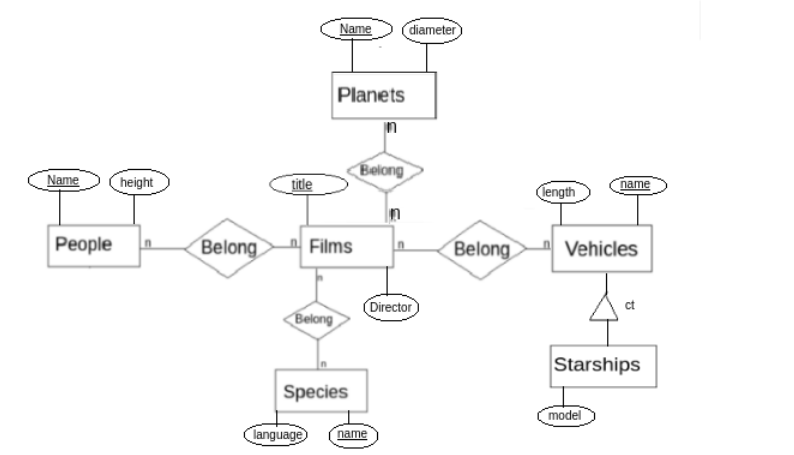

# Aluno
* `240231`: `Lucca Gazotto Vettori`

## Tarefa 1 sobre APIs de acesso
[notebook](https://github.com/lugavt/MC536-2021.2/blob/main/lab01/notebook/lab01-api.ipynb)

## Tarefa 2 sobre Engenharia Reversa

> 

