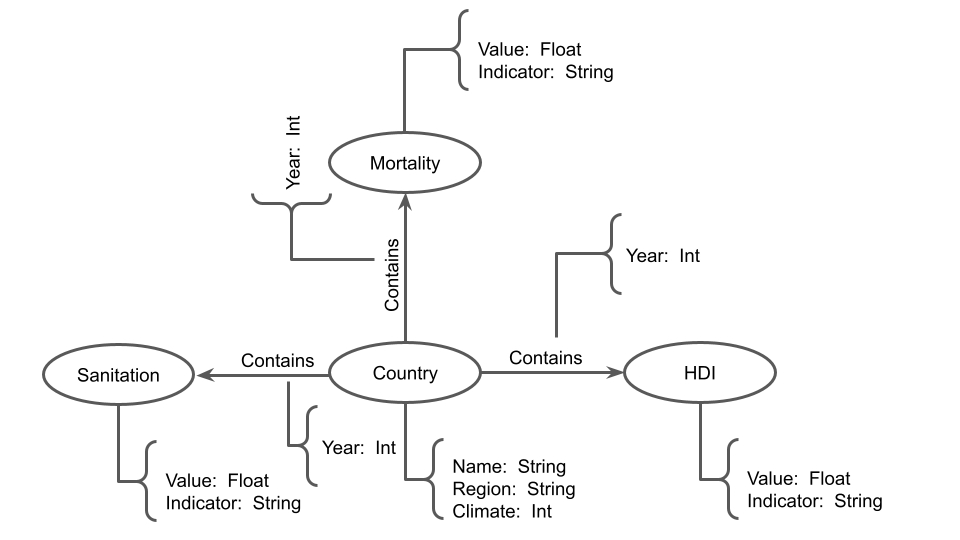

# Modelo para Apresentação do Lab07 - Modelo Lógico para Banco de Dados de Grafos

# Aluno
* `240231`: `Lucca Gazotto Vettori`

## Modelo Lógico do Banco de Dados de Grafos
> 

## Perguntas de Pesquisa/análise

> Liste aqui as três perguntas de pesquisa/análise
> * Qual foi o comportamento observado dos índices de mortalidade nos países quando há alteração em seu IDH(HDI) ao longo dos anos? 
> * Como se relacionam alguns índices de mortalidade com o clima dos países.
> * Os países com os maiores índices de mortalidade são os mesmos com menor índice de saneamento?
